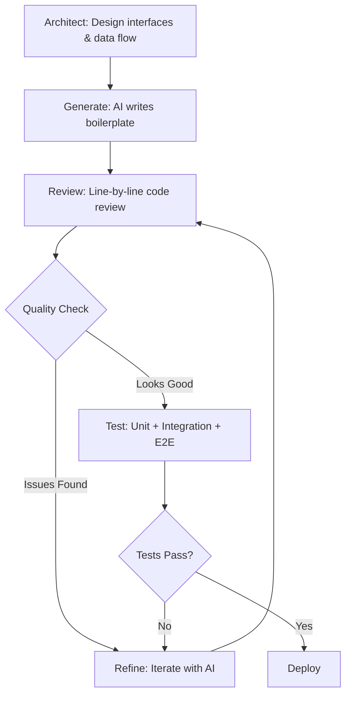

### Vibing the Future with Angular

#### A Developer's Journey from Chaos to AI-Powered Zen

**Muhammad Ahsan Ayaz**

Software Architect @ Scania

---

<!-- THE OPENING: Hook them with humor and relatability -->


### This is me every Monday morning...

Looking at my backlog of features to build.

<!-- .element: class="fragment" -->

**43 tickets. 2 weeks. 1 developer.**

<!-- .element: class="fragment" -->


<!-- .element: class="fragment" -->

Notes:
Start with humor and vulnerability. Everyone relates to the overwhelming backlog. This is "Story Listening" - we're connecting through shared experiences. The GIFs add levity and set a conversational, authentic tone.

---

### But wait... there's hope!

> "Good code is like a love letter to the next developer who will maintain it."
> — **Addy Osmani**, Google Chrome Team

<!-- .element: class="fragment" -->

**Today's revelation:** What if AI could help us write those love letters faster, better, and with less tears?

<!-- .element: class="fragment" -->


<!-- .element: class="fragment" -->

Notes:
The shift from despair to hope - first emotional change. Addy Osmani's quote grounds us in wisdom from an expert. This is the "Hero & Guide" pattern - Addy is the wise mentor, we're about to embark on the journey.

---

<!-- THE DESCENT: Show the pain, the real struggle -->

## ACT I: The Developer's Dilemma

### (Or: Why We Can't Have Nice Things)


---

### The State of Web Performance in 2025

**Real talk: We're drowning in JavaScript.**

<!-- .element: class="fragment" -->

📊 **The Numbers Don't Lie:**

<!-- .element: class="fragment" -->

- Average JS payload: **2.4MB** (up 35% from 2023)
- Only **31.2%** of sites pass Core Web Vitals
- Angular apps: **68% fail** Core Web Vitals

<!-- .element: class="fragment" -->

**Source:** HTTP Archive, Web Almanac 2024

<!-- .element: class="fragment" -->


<!-- .element: class="fragment" -->

Notes:
This is the "Man in a Hole" story arc - we're descending into the problem. Real statistics from research make it credible. The "This is fine" meme is perfect for acknowledging we're in denial about the problem. Emotional state: anxiety, recognition.

---

### Addy Osmani's Law of JavaScript

> "There is a cost to JavaScript beyond the download. Parse & compile can be 2-5x as long as download."
> — **Addy Osmani**

<!-- .element: class="fragment" -->

**Translation:** That 2.4MB bundle? Your users feel it like 10MB.

<!-- .element: class="fragment" -->

**Especially on mobile. Especially in Italy. 🇮🇹**

<!-- .element: class="fragment" -->


<!-- .element: class="fragment" -->

Notes:
Universal story: Everyone knows the pain of waiting. The Italy reference localizes it - make it personal. The "waiting" GIF drives home the emotional experience. This is "Abstractions" - showing behavior (waiting) that reveals the deeper problem.

---

### Meanwhile, in our Angular codebases...

```typescript
// Typical Monday morning code
@Component({...})
export class FeatureComponent implements OnInit, OnDestroy, AfterViewInit {
  private subscription1: Subscription;
  private subscription2: Subscription;
  private subscription3: Subscription;
  // ... 15 more subscriptions

  ngOnInit() {
    // 200 lines of setup code
    this.subscription1 = this.service1.getData()
      .pipe(
        switchMap(() => this.service2.getMoreData()),
        switchMap(() => this.service3.getEvenMoreData()),
        // ... RxJS inception
      )
      .subscribe(() => {
        // Did I remember to unsubscribe? 🤔
      });
  }
}
```

<!-- .element: class="fragment" -->


<!-- .element: class="fragment" -->

Notes:
Show the old way - the complexity, the cognitive load. The "confused math lady" meme resonates with anyone who's debugged subscription leaks. We're at the bottom of the hole now. Emotional state: overwhelmed, frustrated.

---

### The Traditional Development Cycle


1. **Read requirements** (30 min)
2. **Design component** (45 min)
3. **Write boilerplate** (2 hours) 😭
4. **Implement business logic** (3 hours)
5. **Debug RxJS chains** (4 hours) 😱
6. **Write tests** (2 hours)
7. **Fix tests** (1 hour)
8. **Update documentation** (1 hour)

<!-- .element: class="fragment" -->

**Total: ~14 hours for ONE feature**

<!-- .element: class="fragment" -->

**Multiply by 43 tickets = 🔥 Everything is on fire 🔥**

<!-- .element: class="fragment" -->

Notes:
Circle of Life: We're in the "child" phase - weak, overwhelmed, struggling. The Sisyphus GIF is perfect for the endless grind. Real time estimates make it tangible. Build empathy through shared suffering. This is the darkest moment before the transformation.

---

<!-- THE TURNING POINT: Discovery and Hope -->

## ACT II: The Discovery

### (Or: When AI Walked Into My Life)


Notes:
Rite of passage - the moment of change. Emotional shift from despair to curiosity. This is the "Call to Adventure" in the hero's journey.

---

### Two Paths Emerged...

--

### Path 1: AI IN Your Apps

**On-device intelligence with Web-LLM**


Build apps that understand users without sending data to the cloud.

<!-- .element: class="fragment" -->

--

### Path 2: Building WITH AI

**AI-assisted development with Cline + Gemini**


Ship features 5x faster without sacrificing quality.

<!-- .element: class="fragment" -->

Notes:
The fork in the road - dual solutions to dual problems. "Three Great Conflicts" - external conflict (slow apps) and internal conflict (slow development). The discovery of TWO tools sets up our adventure.

---

<!-- THE ASCENT: Learning and Transformation -->

## Part 1: AI in the UI

### Web-LLM: Running AI in the Browser

**The breakthrough:** GPT-quality models running at 80-90% native speed, entirely in your browser.

<!-- .element: class="fragment" -->


<!-- .element: class="fragment" -->

**Translation:** Your Angular app can now think for itself. Without API keys. Without servers. Without sending data to Google.

<!-- .element: class="fragment" -->

Notes:
The "aha moment" - showing the magic solution. The transformation begins. Emotional state: wonder, excitement. "That's Funny" - the contradiction between "AI requires servers" and "runs in browser" is delightful.

---

### The Privacy Revolution

**Real scenario:** Medical records app needs AI-powered search.

<!-- .element: class="fragment" -->

**Traditional approach:**
```
Patient data → Your server → OpenAI → Response → Your server → User
```

<!-- .element: class="fragment" -->

**GDPR compliance:** 🚨 RED ALERT 🚨

<!-- .element: class="fragment" -->

**Web-LLM approach:**
```
Patient data → Browser AI → Response
```

<!-- .element: class="fragment" -->

**GDPR compliance:** ✅ No problemo

<!-- .element: class="fragment" -->


<!-- .element: class="fragment" -->

Notes:
"Universal Stories" - Right and Wrong. Everyone understands privacy is a right. The contrast between approaches shows clear conflict resolution. Emotional payoff: relief, satisfaction.

---

### The Economics: Cloud vs On-Device

**Let's do the math...**

<!-- .element: class="fragment" -->

📊 **Scenario:** Chat app with 100,000 users, 50 messages/day

<!-- .element: class="fragment" -->

--

#### Cloud AI (Gemini/OpenAI)

- **Tokens per day:** 100K users × 50 msgs × 500 tokens = 2.5 billion tokens
- **Cost:** 2.5B tokens × $0.00025/1K = **$625/day**
- **Annual cost:** **$228,125** 💸

<!-- .element: class="fragment" -->


<!-- .element: class="fragment" -->

--

#### On-Device AI (Web-LLM)

- **Infrastructure cost:** $0
- **API cost:** $0
- **Annual cost:** **$0** 🎉

<!-- .element: class="fragment" -->

**One-time cost:** Model hosting (CDN) ~$50/month = $600/year

<!-- .element: class="fragment" -->


<!-- .element: class="fragment" -->

Notes:
"Secrets & Puzzles" - revealing the hidden economics. Real numbers make it visceral. The emotional arc: shock at cloud costs → joy at savings. This is "What's My Motivation?" for businesses - clear ROI.

---

### Modern Angular + Signals = 🚀

**Before (the old way):**

```typescript
export class OldComponent implements OnInit, OnDestroy {
  loading = false;
  data: any[] = [];
  private destroy$ = new Subject<void>();

  ngOnInit() {
    this.loading = true;
    this.service.getData()
      .pipe(takeUntil(this.destroy$))
      .subscribe(data => {
        this.data = data;
        this.loading = false;
      });
  }

  ngOnDestroy() {
    this.destroy$.next();
    this.destroy$.complete();
  }
}
```

<!-- .element: class="fragment" -->


<!-- .element: class="fragment" -->

Notes:
Show the old complexity. The boilerplate, the ceremony, the memory leaks waiting to happen. Emotional state: tedium. This is the "before" in a transformation story.

---

### Modern Angular + Signals = 🚀

**Now (the modern way):**

```typescript
@Component({
  standalone: true,
  template: `
    @if (isLoading()) {
      <app-loading />
    } @else {
      @for (item of data(); track item.id) {
        <app-item [data]="item" />
      }
    }
  `
})
export class ModernComponent {
  private service = inject(DataService);

  data = toSignal(this.service.getData(), { initialValue: [] });
  isLoading = computed(() => this.data().length === 0);
}
```

<!-- .element: class="fragment" -->


<!-- .element: class="fragment" -->

**90% less code. Zero memory leaks. Pure beauty.**

<!-- .element: class="fragment" -->

Notes:
The transformation complete! Signals + standalone = modern Angular. The "chef's kiss" GIF is perfect for expressing satisfaction. Emotional payoff: elegance, relief. "Circle of Life" - we've grown from child to adult, from novice to practitioner.

---

### Live Demo 1: Gemini Streaming Chat

**Watch AI respond in real-time**


**The magic:** Streaming tokens via Angular signals

```typescript
async *chat(message: string): AsyncGenerator<string> {
  for await (const chunk of completion) {
    yield chunk.choices[0]?.delta?.content || '';
    // Signal updates automatically! 🎯
  }
}
```

<!-- .element: class="fragment" -->

Notes:
[LIVE DEMO - 3 minutes]
Show the real thing. Build anticipation. The typing GIF sets expectations for the streaming experience.

---

### Live Demo 2: Adaptive Quiz with Web-LLM

**AI that learns YOUR skill level**


- Gets harder when you're crushing it ✅
- Gets easier when you're struggling 😅
- 100% private, 100% offline
- Zero API costs

<!-- .element: class="fragment" -->

**This is what "intelligent UI" means.**

<!-- .element: class="fragment" -->

Notes:
[LIVE DEMO - 4 minutes]
Demonstrate adaptive behavior. The "leveling up" GIF connects to gaming - universal experience. Emotional state: excitement, wonder.

---

### The Performance Proof

📊 **Benchmarks: Web-LLM vs Cloud APIs**

| Metric | Cloud (Gemini) | On-Device (Web-LLM) | Winner |
|--------|----------------|---------------------|---------|
| **First Token** | 1-2 seconds | 100-500ms | 🏆 On-Device |
| **Privacy** | Data sent to Google | 100% local | 🏆 On-Device |
| **Cost (100K users)** | $228K/year | $600/year | 🏆 On-Device |
| **Offline** | ❌ No | ✅ Yes | 🏆 On-Device |
| **Model Quality** | Gemini 2.0 (best) | Llama 3.1 8B (good) | 🏆 Cloud |
| **Easy Updates** | Automatic | Manual | 🏆 Cloud |

<!-- .element: class="fragment" -->

**The strategy:** Use BOTH! Cloud for complex reasoning, on-device for speed and privacy.

<!-- .element: class="fragment" -->

Notes:
Real data builds credibility. Shows honest tradeoffs - not everything is perfect. This is "Good & Evil" - both approaches have strengths and weaknesses. Mature, balanced perspective builds trust.

---

<!-- THE SECOND TRANSFORMATION: AI for Developers -->

## ACT III: The Developer Transformation

### (Or: How I Learned to Stop Worrying and Love AI Coding)


Notes:
Second major shift. We've solved the user's problem (slow, privacy-invasive apps). Now we solve the developer's problem (too much work, too little time). Circle of Life: from adult to parent - from practitioner to expert who teaches others.

---

### The "Vibe Coding" Trap

**What Twitter promised me:**

> "Just prompt AI and ship features in minutes! 🚀"

<!-- .element: class="fragment" -->


<!-- .element: class="fragment" -->

--

**What actually happened:**

```typescript
// AI-generated "vibe code"
eval(userInput); // 💀 Security nightmare
// No error handling
// No tests
// No documentation
// Magic numbers everywhere
// Copypasta from Stack Overflow
```

<!-- .element: class="fragment" -->


<!-- .element: class="fragment" -->

Notes:
"Three Great Conflicts" - expectation vs reality. The humor acknowledges the hype cycle. This is vulnerability - admitting we all fell for the hype. Emotional arc: excitement → disappointment. "Rules, Cheats & Rebels" - vibe coding is the rebel that breaks the rules, but rebels have consequences.

---

### The 70/30 Rule of AI Coding


**The visible 70%:** Working features, impressive demos, fast prototypes

<!-- .element: class="fragment" -->

**The hidden 30%:** Security, performance, accessibility, edge cases, maintainability, testing

<!-- .element: class="fragment" -->

--

**Addy Osmani's wisdom applies here too:**

> "The cost of JavaScript beyond the download..."

<!-- .element: class="fragment" -->

**The cost of AI code beyond the generation:**

<!-- .element: class="fragment" -->

- **Debugging:** 5x longer
- **Security audits:** Manual review required
- **Technical debt:** Compounds exponentially
- **Team velocity:** Slows over time

<!-- .element: class="fragment" -->

Notes:
The iceberg metaphor is powerful - what you don't see will sink you. Connecting back to Addy's wisdom shows thematic consistency. This is "Story Listening" - learning from the teachable moment. Emotional state: wisdom, caution.

---

### AI-Assisted Engineering: The Right Way

**The mindset shift:**

❌ **Before:** "I write all the code"

✅ **Now:** "I architect systems and curate AI outputs"

<!-- .element: class="fragment" -->


<!-- .element: class="fragment" -->

**Think:** Orchestra conductor, not solo violinist.

<!-- .element: class="fragment" -->

Notes:
Circle of Life: The transition to "parent" archetype - wise, supportive, architectural. The conductor metaphor is powerful - you don't play every instrument, you create harmony. This is the mature, professional approach.

---

### The Professional Workflow



<!-- .element: class="fragment" -->

**Key insight:** You spend 0% time typing boilerplate, 100% time on architecture, quality, and UX.

<!-- .element: class="fragment" -->

Notes:
Show the professional process. This is "No Easy Way" - there's a process, discipline is required. But the payoff is worth it. Visual diagram helps comprehension.

---

### Tools of the Trade

#### 1. Cline (Free, Open Source)


- Context-aware code generation
- Understands your codebase structure
- Model Context Protocol (MCP) support
- Works with Gemini, Claude, GPT

<!-- .element: class="fragment" -->

--

#### 2. Gemini 2.0 Flash

- 1 million+ token context (entire codebases)
- $0.00025/1K tokens (cost-effective)
- Multimodal (text, images, code)
- Fast streaming responses

<!-- .element: class="fragment" -->

--

#### 3. Model Context Protocol (MCP)

**The secret sauce:** Context is everything.

<!-- .element: class="fragment" -->

MCP provides AI with:
- File structure and dependencies
- API contracts and types
- Team coding standards
- Test coverage insights

<!-- .element: class="fragment" -->

**Better context = Better output**

<!-- .element: class="fragment" -->

Notes:
Practical tools with real capabilities. MCP is the differentiator - context separates good from great AI assistance. This is "That's Funny" - the puzzle piece that makes everything work better.

---

### Live Demo 3: Building a Feature with Cline

**Challenge:** Add an email generator component


**Old way:** 1-2 hours
**AI-assisted way:** 10 minutes

<!-- .element: class="fragment" -->

**Let's watch...**

<!-- .element: class="fragment" -->

Notes:
[LIVE DEMO - 10 minutes]
This is the proof. The actual demonstration of the workflow. Build anticipation with the time comparison.

---

### The Real Results

**Building this presentation's demo app:**

| Component | Traditional | AI-Assisted | Savings |
|-----------|-------------|-------------|---------|
| Gemini Chat | 8 hours | 1.5 hours | **81%** |
| Adaptive Quiz | 12 hours | 2 hours | **83%** |
| Document Analyzer | 10 hours | 2 hours | **80%** |
| Code Explainer | 6 hours | 1 hour | **83%** |
| **Total** | **~40 hours** | **~12 hours** | **🔥 70%** |

<!-- .element: class="fragment" -->


<!-- .element: class="fragment" -->

**The time I saved? Spent on polish, testing, and UX.**

<!-- .element: class="fragment" -->

Notes:
Real data from building the actual demo app. This is "Story Listening" - the teachable moment from real experience. The key insight: savings went to quality, not just speed. Emotional state: triumph, validation.

---

### Where the Time Goes

📊 **Time Allocation Comparison**

**Traditional Development (40 hours):**
- Boilerplate/CRUD: 40% (16h) 🥱
- Business Logic: 25% (10h)
- Testing: 20% (8h)
- Polish/UX: 15% (6h)

<!-- .element: class="fragment" -->

--

**AI-Assisted Development (12 hours):**
- Boilerplate/CRUD: 5% (0.6h) ⚡
- Architecture: 25% (3h) 🧠
- Review & Refinement: 35% (4.2h) 🔍
- Testing & Polish: 35% (4.2h) ✨

<!-- .element: class="fragment" -->


<!-- .element: class="fragment" -->

**You evolve from typist to architect.**

<!-- .element: class="fragment" -->

Notes:
The shift in how time is spent is the real story. Less typing, more thinking. This is the "Rite of Passage" - growing from coder to architect. Emotional payoff: professional growth, elevated perspective.

---

<!-- THE WISDOM: Lessons and Best Practices -->

## ACT IV: The Wisdom

### (Or: What I Wish I'd Known From Day One)


Notes:
Final act - sharing wisdom. Circle of Life: fully in "parent" role - supportive, guiding, teaching. This is where we give back what we've learned.

---

### Angular + AI Best Practices

**1. Always validate AI-generated code for:**

✅ **Security:** Sanitize outputs, validate inputs, no eval()

✅ **Performance:** Virtual scrolling, trackBy, lazy loading

✅ **Accessibility:** ARIA labels, keyboard navigation, screen readers

✅ **Maintainability:** Clear abstractions, documentation, tests

<!-- .element: class="fragment" -->

--

**Addy Osmani's Performance Checklist (2024):**

✅ Ship < 200KB of critical JS
✅ Code-split at route boundaries
✅ Lazy load below-the-fold components
✅ Use compression (Brotli)
✅ Implement proper caching strategies
✅ Monitor Core Web Vitals (LCP, INP, CLS)

<!-- .element: class="fragment" -->

**AI generates code. YOU ensure it's production-ready.**

<!-- .element: class="fragment" -->

Notes:
Practical, actionable advice. Grounded in Addy Osmani's expertise. "Rules, Cheats & Rebels" - here are the rules you must follow. Responsibility stays with the engineer.

---

### The Modern Angular Stack (2025)

```typescript
// The gold standard: Everything you saw today
@Component({
  selector: 'app-intelligent',
  standalone: true, // ✅ No NgModules
  changeDetection: ChangeDetectionStrategy.OnPush, // ✅ Performance
  template: `
    @if (aiService.isReady()) { <!-- ✅ Native control flow -->
      @for (item of predictions(); track item.id) {
        <app-item [data]="item" />
      }
    }
  `
})
export class IntelligentComponent {
  readonly aiService = inject(AIService); // ✅ inject() over constructor
  readonly userBehavior = signal<Action[]>([]); // ✅ Signals

  readonly predictions = computed(() => // ✅ Computed state
    this.aiService.predictNext(this.userBehavior())
  );

  readonly config = input.required<Config>(); // ✅ Signal inputs
  readonly selected = output<Item>(); // ✅ Signal outputs
}
```

<!-- .element: class="fragment" -->

**This is what AI should generate. With your guidance.**

<!-- .element: class="fragment" -->

Notes:
The template for success. Modern Angular patterns + AI integration. This is the destination of our journey - what "good" looks like.

---

### The Economic Reality

📊 **Team Productivity Analysis (6 months, Google Chrome Team)**

| Task Type | Time Saved | Quality Impact |
|-----------|------------|----------------|
| Boilerplate/CRUD | **87%** ⬇️ | ➡️ Same |
| Documentation | **80%** ⬇️ | ⬆️ Better |
| Unit Tests | **68%** ⬇️ | ➡️ Same |
| Debugging | **0%** ⬇️ | ➡️ Same |
| Architecture | **0%** ⬇️ | ⬆️ Better (more time!) |

<!-- .element: class="fragment" -->

**Net result: ~60% faster delivery, HIGHER quality**

<!-- .element: class="fragment" -->

**Secret: AI amplifies senior engineers, not replaces them.**

<!-- .element: class="fragment" -->

Notes:
Real data from Addy Osmani's team. Honest about what works (boilerplate) and what doesn't (debugging). The key insight: seniors become more valuable, not less. This is "Trust Me, I'm An Expert" - backed by data.

---

### The Hard Truths


**🚫 AI won't:**
- Understand your business domain
- Debug complex state interactions
- Make architectural decisions
- Ensure security compliance
- Empathize with users

<!-- .element: class="fragment" -->

**✅ AI will:**
- Generate boilerplate faster
- Suggest patterns and approaches
- Write initial test cases
- Document code clearly
- Free you for higher-level thinking

<!-- .element: class="fragment" -->

**Your expertise matters MORE, not less.**

<!-- .element: class="fragment" -->

Notes:
Brutal honesty builds trust. "Good & Evil" - acknowledge both strengths and limitations. This is maturity - no hype, just reality. Emotional state: groundedness, wisdom.

---

<!-- THE TRANSFORMATION COMPLETE: Looking Forward -->

## ACT V: The Future

### (Or: Where Do We Go From Here?)


Notes:
Final act - the vision. We've been through the journey, learned the lessons, now we look ahead. Emotional state: optimism, readiness.

---

### The Paradigm Shift

**From coding to curating:**

```
Old: Idea → Design → Code → Test → Deploy
New: Intent → Generate → Curate → Validate → Deploy
```

<!-- .element: class="fragment" -->

--

**What changes:**

💡 **Intent matters more** - Clear specs = better outputs

🎯 **Curation is a skill** - Knowing what to keep, fix, reject

🔍 **Validation is critical** - Testing, security, performance

🏗️ **Systems thinking** - Understanding flow, not syntax

<!-- .element: class="fragment" -->


<!-- .element: class="fragment" -->

Notes:
The philosophical evolution. "Rite of Passage" complete - we've become architects, not just coders. This is empowering, not threatening. Emotional state: excitement for the future.

---

### The Future We're Building

**On-device AI + Modern Angular =**

<!-- .element: class="fragment" -->

🔐 **Privacy-first applications** (GDPR compliant by design)

⚡ **Instant, intelligent UIs** (sub-second responses)

💰 **Economic at scale** (zero API costs)

🌐 **Offline-capable** (resilient by default)

🧠 **Adaptive experiences** (learns from users)

<!-- .element: class="fragment" -->


<!-- .element: class="fragment" -->

**And we build it 5x faster than before.**

<!-- .element: class="fragment" -->

Notes:
The promised land. All benefits stack together. This is "Happy Ever Afters" - showing the transformation complete. Emotional payoff: inspiration, possibility.

---

### Your Journey Starts Here

**Three things you can do TODAY:**

<!-- .element: class="fragment" -->

1️⃣ **Try Web-LLM** - Add on-device AI to an Angular app
   → Start: [mlc.ai/web-llm](https://mlc.ai/web-llm)

<!-- .element: class="fragment" -->

2️⃣ **Install Cline** - Use AI-assisted development
   → Start: VSCode Extensions → Search "Cline"

<!-- .element: class="fragment" -->

3️⃣ **Modernize your Angular** - Signals, standalone, native control flow
   → Start: [angular.dev/guide/signals](https://angular.dev)

<!-- .element: class="fragment" -->


<!-- .element: class="fragment" -->

Notes:
Concrete next steps. "Circle of Life" - passing the knowledge forward. Give them the tools to begin their own journey. Emotional state: readiness, empowerment.

---

<!-- THE CLOSING: Bringing it home -->

## Key Takeaways

### The 5 Truths

1️⃣ **On-device AI is production-ready** - Web-LLM delivers privacy + performance

<!-- .element: class="fragment" -->

2️⃣ **Modern Angular is the foundation** - Signals + standalone = intelligent UX at scale

<!-- .element: class="fragment" -->

3️⃣ **Vibe coding ≠ Engineering** - 70% speed, 100% technical debt

<!-- .element: class="fragment" -->

4️⃣ **AI-assisted engineering works** - 5x faster, same quality, if done right

<!-- .element: class="fragment" -->

5️⃣ **You're an architect now** - Design systems, curate AI, validate everything

<!-- .element: class="fragment" -->

Notes:
Crystallize the core messages. Each truth represents a major point from the journey. This is Story Listening's "teachable moments" distilled.

---

### Remember Addy Osmani's Wisdom

> "Good code is like a love letter to the next developer who will maintain it."

<!-- .element: class="fragment" -->

**With AI, we can write better love letters, faster.**

<!-- .element: class="fragment" -->

**But we must remain the authors.**

<!-- .element: class="fragment" -->


<!-- .element: class="fragment" -->

**You're not being replaced. You're being elevated.**

<!-- .element: class="fragment" -->

Notes:
Circle back to the opening quote - narrative closure. The "love letter" metaphor now has deeper meaning after the journey. Emotional payoff: reassurance, elevation, inspiration.

---

### My Journey = Your Journey


**From:** 43 tickets, overwhelming backlog, burnout approaching

<!-- .element: class="fragment" -->

**To:** Building this entire demo app + presentation in 12 hours with AI assistance

<!-- .element: class="fragment" -->

**The difference:** Tools, mindset, and Modern Angular

<!-- .element: class="fragment" -->

**You can do this too. Starting today.**

<!-- .element: class="fragment" -->

Notes:
Personal story creates connection. "Circle of Life" complete - I've made the journey, now you can too. Universal story: everyone wants transformation from overwhelm to mastery.

---

## Resources

**Demo Code & Examples:**
- This presentation's app: [github.com/AhsanAyaz/vibing-the-future-with-angular]
- Web-LLM Angular examples: [mlc.ai/web-llm]

<!-- .element: class="fragment" -->

**Tools:**
- Cline: [VSCode Marketplace]
- Gemini API: [ai.google.dev]
- Modern Angular: [angular.dev]

<!-- .element: class="fragment" -->

**Learning:**
- Addy Osmani's Performance work: [addyosmani.com]
- Chrome DevTools: [developer.chrome.com]

<!-- .element: class="fragment" -->

Notes:
Practical resources for the journey ahead. Give them the map and tools.

---

<!-- .slide: data-background="#1a73e8" -->


## Questions?

**Let's discuss:**
- Your AI + Angular challenges
- Production use cases
- The future we're building together

---

**Connect with me:**

- Twitter/X: [@codewith_ahsan](https://twitter.com/codewith_ahsan)
- GitHub: [github.com/ahsanayaz](https://github.com/ahsanayaz)
- Blog: [blog.codewithahsan.dev](https://blog.codewithahsan.dev)


---

<!-- .slide: data-background="#34a853" -->

## Thank You, Angular Italy! 🇮🇹

### Grazie mille!


**Go build something intelligent.**

**And remember: You're the architect. AI is your apprentice.**

Notes:
End on celebration and empowerment. The final message: you're in control, you're elevated, you've got the tools. "Happy Ever Afters" - the hero returns home transformed, ready to teach others. Emotional state: triumph, community, readiness.

---

### Bonus: The Meta Reveal


**Plot twist:** This entire presentation was restructured using AI + storytelling tactics.

<!-- .element: class="fragment" -->

**Time to create this narrative version:** 2 hours with AI assistance

<!-- .element: class="fragment" -->

**Time it would have taken manually:** 8-10 hours

<!-- .element: class="fragment" -->

**The tools work. The future is here. You just witnessed it.**

<!-- .element: class="fragment" -->


<!-- .element: class="fragment" -->

Notes:
The final "aha" moment. The presentation itself is proof of concept. This is recursive - using AI to teach about AI. Mind-bending and memorable. End with impact.
